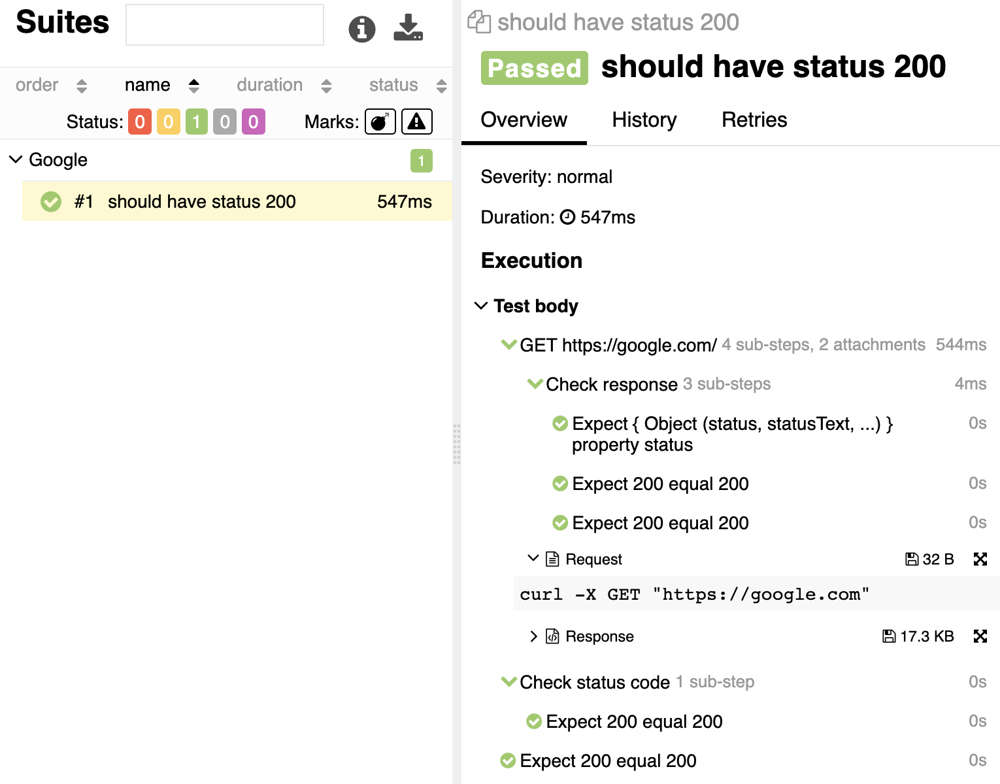

# rest-api-allure-testing-helper
Simple library for testing rest api with nodejs, mocha, allure and chai.

## Installation

```
npm i --save rest-api-allure-testing-helper
npm i --save allure-mocha 
```

## Example of usage

```js
const {Request,expect} = require("rest-api-allure-testing-helper");
const r = new Request();

describe('Google', function() {
    it('should have status 200', async function() {
        let response = await r.get("https://google.com", {}, (res,body,status)=>{
                res.property("status").equal(200);
                status.equal(200);
            });
        response.checkStatus((status)=>{
            status.equal(200);
        });
        expect(response.status).equal(200);
    });
});
```
## Result of the example

!!!IMPORTANT: allure report will be generated only if allure-mocha is enabled, example: `npx mocha -R allure-mocha`

## Features

### Request
You can send any type by calling object of the Request class.
Requests are building with [Axios](https://github.com/axios/axios), so you can provide any options to your request, example:
```js
const {Request,expect} = require("rest-api-allure-testing-helper");
const r = new Request();
const response = await r.get("https://google.com", {headers: {'X-Custom-Header': 'foobar'}});
```
Read more about axios options at the [axios web site](https://axios-http.com/docs/req_config).

### Console output

By default, every request printing information about himself at the console, example:
```bash
================REQUEST=======================
Request: curl -X GET "https://api.ethplorer.io/getLastBlock?apiKey=freekey"
================RESPONSE======================
Status code: 200
Body: {
  "lastBlock": 12381404
}
Response time: 394 ms
==============================================

```
Request is printing in curl format.
Response is printing http status code, response time and body data.
You easily can disable console output by providing disableConsoleOutput option to the request or with setting constructor of the request, example:
```js
const {Request,expect} = require("rest-api-allure-testing-helper");
const r = new Request(true);

describe('Google', function() {
    it('should have status 200', async function() {
        let response = await r.get("https://google.com", {disableConsoleOutput:true});
    });
});
```

### Checks
You can add results of the [chai](https://github.com/chaijs/chai) asserts directly to the allure report by using embedded "checks" functionality.
There are three different ways how you can do this:
1) Using checks parameter of the request call. You should provide a function with chai asserts. Function gets as parameter wrapped chai.expect() function with full axios response, response data and response status. It will put information about asserts directly to the request allure step, example:
```js
let response = await r.get("https://google.com", {}, (res,body,status)=>{
        res.property("status").equal(200);
        status.equal(200);
    });
```
2) By calling .checkResponse .checkStatus .checkField .checkBody .checkRequest .checkHeaders .checkStatusText .checkConfig methods of the request. It will put information about asserts to the separate step, example:
```js
let response = await r.get("https://api.ethplorer.io/getLastBlock?apiKey=freekey", {});
response.checkStatus((status)=>{
    status.equal(200);
});

response.checkField("lastBlock", (field)=>{
    field.to.be.greaterThan(100);
});
```
3) By calling chai.expect() function which can be imported from the rest-api-allure-testing-helper module. It will put information about asserts to the separate autogenerated step, example:
```js
const {Request,expect} = require("rest-api-allure-testing-helper");
const r = new Request(true);

describe('Google', function() {
    it('should have status 200', async function() {
        let response = await r.get("https://google.com", {disableConsoleOutput:true});
        expect(response.status).equal(200);
    });
});
```
!!!IMPORTANT: only chai.expect() syntax is supported.!!! 